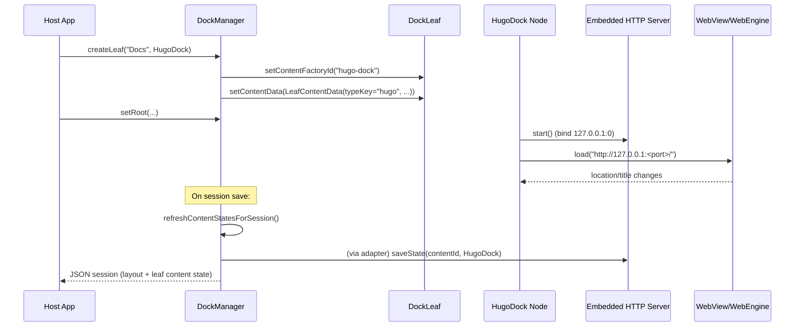
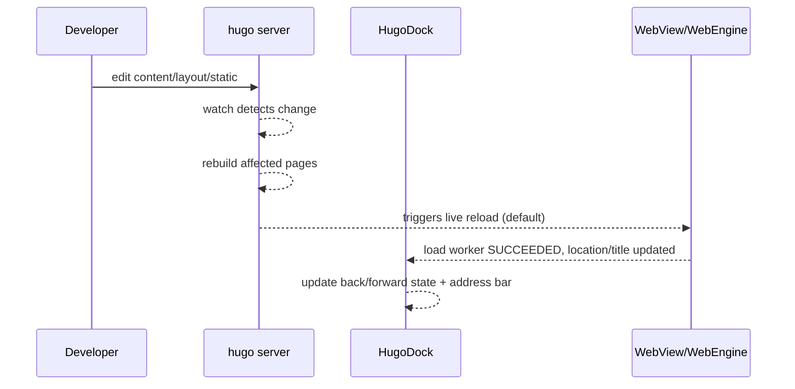

# Developing a Hugo Docking Component for PapiflyFX Docking

## Executive summary

This report proposes a “Hugo dock” content type for your PapiflyFX docking framework that embeds a Hugo-generated static documentation/help site inside a dockable JavaFX component. The design aligns with the framework’s existing persistence model (leaf identity + optional versioned state via `LeafContentData` and `ContentStateAdapter`) and lifecycle expectations (leaf disposal calling `DisposableContent.dispose()`). citeturn13view0turn10view1turn10view0turn40view0

The recommended architecture is a **JavaFX WebView (WebEngine) + local embedded HTTP server** that serves the built Hugo site from either (a) the filesystem (dev or unpacked mode) or (b) classpath resources/JAR (packaged mode). This avoids many pitfalls of `file://` origins (notably same-origin/CORS behavior for local files) and enables consistent application of HTTP response headers (CSP, caching, etc.). citeturn28view1turn47view1turn45view1turn45view0turn47view0

For development, the simplest workflow is to point the dock at **`hugo server`** (external or managed process) for live reload. Hugo’s built-in server watches files and live reloads open pages, with tunable options like `--bind`, `--port`, `--disableFastRender`, and `--disableLiveReload`. citeturn27view0

Security hinges on treating the docked web UI as “active content”: if you expose a Java↔JS bridge (via `JSObject.setMember`), you must constrain navigation origins and bridge surface area. The JavaFX WebEngine documentation explicitly describes how `setMember` enables callbacks into Java and notes subtle lifecycle behaviors (e.g., weak references) and JPMS accessibility requirements (“opens … to javafx.web”). citeturn28view0turn28view1

## Goals and use cases

The component’s scope is best framed as **a reusable “documentation/help UI” dock** rather than a general browser tab. The requirements below map directly to PapiflyFX’s docking model (leaves with content + serializable session state) and Hugo’s build/serve capabilities. citeturn13view0turn27view0turn27view1

**Embed Hugo-generated site in a dockable JavaFX component.**  
A dock leaf should host a `Node` backed by a web renderer, with the node participating in close/minimize/maximize/floating and session persistence. In PapiflyFX, leaves hold a `Node` and optionally store (a) a factory id (`contentFactoryId`) and (b) `LeafContentData` for typed, versioned state capture/restore. citeturn40view0turn10view0turn10view1turn13view0

**Live reload during development.**  
During authoring, you want Hugo’s fast rebuild loop and live reload. Hugo’s docs state that `hugo server` watches for changes and “live reload[s] any open browser pages” by default, and provides flags to control fast render and live reload behavior. citeturn27view0

**Offline packaged site.**  
In production, the site must work without network access and be distributable as part of the application artifact. Hugo’s build command supports emitting output to a chosen destination (e.g., a generated-resources directory) and Hugo config includes `publishDir`. citeturn27view1turn44view0

**Navigation & history integration.**  
Users expect back/forward/reload and a stable URL/location concept. JavaFX WebEngine supports URL loading, exposes the current location, and allows executing JavaScript such as `history.back()` from Java. citeturn28view1

**Inter-component messaging.**  
The dock should be able to receive commands from the host app (navigate to a page, highlight/search, open an anchor) and optionally allow the embedded site to emit events to Java (e.g., “open this domain object”). JavaFX WebEngine explicitly documents enabling JavaScript-to-Java calls via `JSObject.setMember`. citeturn28view0

## Architecture options and recommendation

### Option comparison

| Option | What it is | Pros | Cons / risks | Fit for your goals |
|---|---|---|---|---|
| `file://` loading (WebView) | Build site to disk and `webEngine.load(fileUri)` | No embedded server dependency; trivial implementation | `file:///` origins are commonly treated as **opaque**, and same-directory files may not be same-origin → can trigger CORS errors; harder to set HTTP headers (CSP, cache) citeturn47view1turn47view0 | Works for “pure static HTML/CSS” sites, tends to break as sites add JS fetch/search/indexing |
| WebView `loadContent` + custom resource fetching | Load HTML as a string, intercept or rewrite resource URLs | Avoids server; can inject CSP/meta and bridge bootstrap | Becomes a “mini browser implementation”: rewriting relative paths, fetching assets, handling history is complex; still lacks HTTP header control unless you simulate it citeturn28view1turn28view0 | Useful for single-page “template” UIs, not great for Hugo’s multi-file output |
| Embedded HTTP server + WebView | Serve static site to `http://127.0.0.1:<port>/` and load with WebEngine | Stable origin semantics; easy to apply headers; mirrors real deployments; good for Hugo output; supports caching/range requests depending on server citeturn28view1turn45view0turn45view1turn47view0 | Adds a server dependency and lifecycle management; port binding must be handled |
| External `hugo server` + WebView | In dev, load `http://127.0.0.1:1313/` (or configured port) | Best live-reload UX; Hugo already handles watching and live reload; rich CLI knobs citeturn27view0 | Dev-only unless you ship Hugo; needs process management or user-run server |
| JCEF (Chromium-based) | Embed Chromium via JCEF instead of WebView | More “evergreen” browser behavior; broad web API compatibility; powerful hooks (protocols, JS extensions) citeturn30view0 | Significantly larger footprint and packaging complexity (native binaries per OS/arch); more moving parts than WebView |
| Alternate engines (e.g., OS browser controls) | Platform-specific browser embedding | Potentially best native integration per OS | Non-portable and higher maintenance | Not aligned with “no specific OS constraints” |

### Recommended choice

**Use WebView + embedded HTTP server as the production baseline**, and **support a dev mode that targets `hugo server`**.

This recommendation is grounded in:

1. **Origin correctness and resilience**: local file origins often behave as opaque, producing CORS surprises for sites that load assets or data dynamically; a localhost HTTP origin avoids that class of issues. citeturn47view1turn28view1  
2. **Header-based security controls**: CSP is designed to be delivered via HTTP response headers; an embedded server is the cleanest way to apply it. citeturn47view0  
3. **Operational flexibility**: you can serve from filesystem in dev/unpacked mode and from classpath in packaged mode, using mainstream embedded servers with static resource handlers (Jetty `ResourceHandler`, Undertow `ResourceHandler` + `ClassPathResourceManager`). citeturn45view0turn45view1turn45view2  
4. **Alignment with framework lifecycle/persistence**: the dock’s node can implement `DisposableContent` so leaf closure disposes server/browser resources, and it can provide a `ContentStateAdapter` for session restore. citeturn40view0turn10view1turn42view0turn43view2  

## Build and packaging strategies

### Hugo build integration

Hugo’s CLI provides explicit build outputs and destinations:

- `hugo build` is the build command. citeturn27view1  
- The `--destination` flag writes generated files to a chosen directory. citeturn27view1  
- Hugo configuration includes `publishDir` (default `public`) controlling the publish directory. citeturn44view0  

A build strategy compatible with your Maven multi-module setup is:

1. Treat the Hugo site sources as **project input** (e.g., `src/docs-site/` or a dedicated sibling repo).
2. During Maven build, run `hugo build --destination <module>/target/classes/<prefix>/` (or `target/generated-resources/...` copied into resources) so the www output is placed on the classpath.
3. At runtime, serve that classpath prefix via the embedded server and load it in WebView.

This matches the framework’s “pure programmatic / no FXML” ethos: the web UI is just static resources packaged and served. citeturn13view0turn45view1

### Asset paths and base URL strategy

In an embedded scenario with a random localhost port, **avoid baking a host+port into generated links**. Hugo’s URL-related functions and settings are sensitive to `baseURL`; for example, `urls.AbsURL` explicitly depends on the input and the configured `baseURL`. citeturn26search6turn27view0turn27view1

Practical implications for embedded runtime:

- Favor **root-relative** or **relative** links (so the current origin’s port is naturally used).
- Avoid templates/themes that hardcode `.Site.BaseURL` into href/src unless you can guarantee it won’t embed an unusable origin for your runtime. (This is a theme/content governance issue more than a Java issue.) citeturn44view0turn26search6  
- If you must support “host-baked” links, you can add a server-side HTML rewrite layer, but that increases complexity and should be an explicit opt-in feature.

### Packaged app runtime flow

Below is a concrete runtime model that integrates with PapiflyFX session persistence.



PapiflyFX captures content state automatically during session capture and uses adapter restore / factory fallback / placeholder logic during restore. citeturn13view0turn43view2turn43view1turn35view2

## Development workflow with live reload

### Recommended dev modes

Hugo’s server is purpose-built for fast feedback:

- It watches for changes and live reloads open pages by default. citeturn27view0  
- It can render to memory (`--renderToMemory`) and includes flags relevant to correctness vs speed (`--disableFastRender`). citeturn27view0  
- Defaults and controls (`--bind`, `--port`, `--baseURL`, `--liveReloadPort`, `--disableLiveReload`) are documented. citeturn27view0  

Two practical patterns:

**Pattern A: “Dock attaches to external hugo server.”**  
Developer runs `hugo server` and points `HugoDock` to that URL. This keeps the Java component simple and avoids bundling/launching Hugo.

**Pattern B: “Dock manages hugo server process.”**  
`HugoDock` starts/stops Hugo via `ProcessBuilder` using a config-provided site directory. This improves ergonomics but introduces process lifecycle concerns and requires the Hugo binary to exist in the dev environment (or be provisioned).

### Dev live-reload flow diagram



This workflow is directly supported by Hugo’s default server behavior (“watch … automatically rebuild … live reload”). citeturn27view0

### Hot reload inside WebView without Hugo’s live reload

If WebView compatibility with Hugo’s live reload mechanism is ever problematic, you can fall back to “poll + reload” approaches:

- Hugo supports poll-based watching (`--poll`) and you can trigger a WebView reload after detecting site output changes yourself. citeturn27view0  
- JavaFX WebEngine exposes load worker lifecycle and `getLocation()` usage patterns for updating UI upon successful load. citeturn28view1  

This fallback should be treated as a contingency mode, because it is less ergonomic than Hugo’s live reload and can introduce flicker.

## Security and sandboxing

### Threat model and boundary choice

A Hugo-generated site is “static”, but it frequently includes JavaScript (search, navigation behaviors, theme code). Once JavaScript runs in the embedded browser, the security boundary becomes: **web content + browser engine + any exposed native bridge**. JavaFX WebEngine explicitly supports two-way Java/JavaScript communication and documents how to bind Java objects into JavaScript via `JSObject.setMember`. citeturn28view0turn28view1

This section focuses on controls that are feasible in your architecture.

### Prefer localhost HTTP over `file://` for predictable origins

Modern browsers commonly treat `file:///` origins as opaque; even files in the same directory may not be considered same-origin and can trigger CORS errors. citeturn47view1  
Even if JavaFX WebView’s behavior differs in edge cases, relying on file-origin semantics is a long-term fragility. A localhost HTTP origin avoids this risk class and gives you server-side header control. citeturn28view1turn45view1

### Use CSP when you can control responses

Content Security Policy (CSP) is designed to reduce risk of threats like XSS by restricting which resources a document can load and execute. citeturn47view0  
If you serve the site through an embedded HTTP server, you can add a CSP header to HTML responses (and optionally other security headers). This is far harder with pure `file://` loading because there is no HTTP response boundary. citeturn47view0turn47view1

### Treat JS↔native bridges as high risk; constrain aggressively

JavaFX WebEngine’s documented bridge mechanism (`JSObject.setMember`) is powerful: it exposes Java methods to JavaScript (public class/method required), so web content can invoke native code. citeturn28view0  
Broader WebView security guidance (e.g., Android’s WebView native bridge guidance) emphasizes that injecting native interfaces can allow malicious content to execute native code “with the permissions of the host application” and recommends mitigations like disabling JavaScript if not needed and removing bridges before loading untrusted content. citeturn47view2

**Practical mitigations for a Hugo dock:**

- **Origin allowlist**: only allow navigation within the local origin (dev server origin or embedded server origin). Open external links in the system browser (no bridge). This reduces exposure to untrusted remote content.
- **Bridge minimization**: expose a single “message sink” method (e.g., `postMessage(String json)`) rather than exposing domain objects or broad APIs.
- **Bridge lifetime discipline**: WebEngine notes that objects bound via `setMember` are held with weak references; hold a strong reference on the Java side to ensure predictable behavior. citeturn28view0  
- **JPMS correctness**: when running as a named module, WebEngine requires that packages containing Java classes passed to JavaScript are reflectively accessible (e.g., `opens ... to javafx.web`). citeturn28view0  

## Component API design and integration points

### Proposed public API surface

Below is an API shape that matches PapiflyFX’s patterns (leaf content node + optional `ContentStateAdapter` + `DisposableContent` lifecycle). citeturn40view0turn10view1turn42view0

**Core types (conceptual):**

- `HugoDock` (JavaFX `Node`, e.g., `BorderPane`) implements `DisposableContent` so closing the dock leaf releases resources. PapiflyFX calls `DisposableContent.dispose()` from `DockLeaf.dispose()`. citeturn40view0turn8view1  
- `HugoDockConfig` (record/class) describing:
  - `Mode`: `DEV_SERVER`, `EMBEDDED_HTTP`, `FILE_SYSTEM` (discouraged), maybe `EXTERNAL_URL`
  - Origins/URLs: `URI startUri`, allowlisted origin(s)
  - Bridge enablement: `boolean enableBridge`, message handler callback
  - Storage policy: optional `Path userDataDir` (for local storage control)
- `HugoDockStateAdapter` implements `ContentStateAdapter` for persistence; discovered via `ServiceLoader` (via `ContentStateRegistry.fromServiceLoader()`). citeturn10view1turn42view0turn43view0  

### Persistence mapping to PapiflyFX

PapiflyFX restore behavior for a leaf is:

1. If `LeafContentData` exists and a matching adapter is registered, `adapter.restore(contentData)` is attempted.
2. Else, if a `ContentFactory` exists and `contentFactoryId` is set, the factory is used.
3. Else, a placeholder node is created. citeturn43view1turn43view2  

For the Hugo dock, treat the **site identity** (which site) and **navigation state** (which page) as the durable portion.

Recommended `LeafContentData` schema (example):

- `typeKey`: `"hugo"`
- `contentId`: a stable site identifier (e.g., `"help"`, `"docs:<project>"`)
- `version`: start at `1`
- `state` map (versioned):
  - `startPath` or `currentPath` (relative URL path)
  - optional: `scrollY` (captured via JS)
  - optional: `devMode` flag omitted from persistence (prefer environment config)

This aligns with the API record design used by PapiflyFX (`LeafContentData(typeKey, contentId, version, state)`). citeturn10view0turn10view1

### WebView integration sketch

JavaFX WebEngine supports loading by URL (`load(String)`), tracking load completion, and executing JavaScript extensions like `history.back()`. citeturn28view1

```java
public final class HugoDock extends BorderPane implements org.metalib.papifly.fx.docking.api.DisposableContent {

  private final javafx.scene.web.WebView webView = new javafx.scene.web.WebView();
  private final javafx.scene.web.WebEngine engine = webView.getEngine();

  // Strong ref required: WebEngine docs note JSObject bindings use weak references.
  // Hold the bridge object for reliable callback behavior.
  private final Object bridge = new Bridge();

  public HugoDock(java.net.URI startUri) {
    setCenter(webView);

    engine.getLoadWorker().stateProperty().addListener((obs, oldState, newState) -> {
      if (newState == javafx.concurrent.Worker.State.SUCCEEDED) {
        // Update address bar / leaf title using engine.getLocation() if desired.
      }
    });

    // Optional JS bridge (see security notes).
    var window = (netscape.javascript.JSObject) engine.executeScript("window");
    window.setMember("papifly", bridge);

    engine.load(startUri.toString());
  }

  public void back() { engine.executeScript("history.back()"); }
  public void forward() { engine.executeScript("history.forward()"); }
  public void reload() { engine.reload(); }

  @Override
  public void dispose() {
    // Stop embedded server (if owned) + clear references as needed.
    setCenter(null);
  }

  public final class Bridge {
    public void postMessage(String json) {
      // parse + dispatch to host application (strict allowlist!)
    }
  }
}
```

Key bridge and modularity constraints come from the WebEngine docs (how `setMember` enables Java callbacks, weak-reference behavior, and the “opens … to javafx.web” requirement for named modules). citeturn28view0turn28view1

### Embedded server setup sketch

Both Jetty and Undertow provide explicit “static resource handler” capabilities.

- Jetty’s programming guide describes `ResourceHandler` for static content, highlights efficiency (async writes, direct buffers, caching), and lists features relevant to documentation sites (welcome files, range requests). citeturn45view0  
- Undertow docs describe a `ResourceHandler` that uses a `ResourceManager`, with file system and classpath resource managers and optional caching wrappers. citeturn45view1turn45view2  

A minimal Undertow approach for packaged resources:

```java
// Concept sketch: serve classpath resources under /docs-site at http://127.0.0.1:<port>/
io.undertow.server.handlers.resource.ResourceManager rm =
    new io.undertow.server.handlers.resource.ClassPathResourceManager(
        HugoDock.class.getClassLoader(),
        "docs-site" // classpath prefix where Hugo output is packaged
    );

io.undertow.server.handlers.resource.ResourceHandler rh =
    new io.undertow.server.handlers.resource.ResourceHandler(rm)
        .setWelcomeFiles("index.html");

io.undertow.Undertow server = io.undertow.Undertow.builder()
    .addHttpListener(0, "127.0.0.1") // ephemeral port
    .setHandler(exchange -> {
      // Add CSP/header policy for HTML responses here when feasible
      rh.handleRequest(exchange);
    })
    .build();

server.start();
```

Undertow’s documentation explicitly calls out classpath-based resource managers and caching resource managers, and the `ClassPathResourceManager` API documents resource lookup behavior and constructors supporting classpath prefixes. citeturn45view1turn45view2

## Performance, testing, compatibility, and documentation plan

### Performance and memory considerations

- **Static serving efficiency**: Jetty’s `ResourceHandler` is tuned for static content (async writes, caching, and range requests) and is explicitly positioned as capable enough to serve static resources efficiently. citeturn45view0  
- **Undertow flexibility**: Undertow’s resource handler abstraction supports classpath and filesystem resources and can be wrapped with in-memory caching via a caching resource manager. citeturn45view1  
- **WebView costs**: WebEngine runs JavaScript and provides DOM access; it must be accessed on the JavaFX Application thread. This has practical implications for how you structure message dispatch and background work (e.g., keep heavy parsing off-thread, marshal UI actions onto FX thread). citeturn28view0turn28view1  

Recommendation: treat performance as a **profiling-driven** domain (especially across OSs), and provide config toggles for caching headers, compression support (if server supports precompressed artifacts), and bridge enablement.

### Testing strategy

PapiflyFX already uses TestFX patterns and explicitly documents headless UI testing via Monocle for the docking framework module. citeturn13view0  
A Hugo dock testing pyramid can mirror that approach:

- **Unit tests (non-UI)**:  
  - URL normalization and allowlist logic  
  - State encode/decode (the adapter’s `saveState`/`restore` map schema) in isolation, matching PapiflyFX’s `ContentStateAdapter` contract. citeturn10view1turn42view0  
- **Integration tests (UI + embedded server)**:  
  - Start embedded server on ephemeral port, load an embedded test site, wait for WebEngine `SUCCEEDED`, assert `engine.getLocation()` and title update expectations. citeturn28view1turn45view1  
- **Docking integration tests (session save/restore)**:  
  - Create `DockManager`, register `ContentStateRegistry` (including service loader or explicit registration), create leaf with HugoDock, navigate, save session, restore session, and assert the restored dock loads the correct path using the restore chain documented in `LayoutFactory`. citeturn35view2turn42view0turn43view2  

### Migration and compatibility

**Java / JavaFX targeting.**  
Your repository documentation indicates a current baseline of Java 25 and JavaFX 23.0.1 (and lists modular artifacts). citeturn1view0turn13view0  
Given the user-facing nature of documentation docks, consider designing the Hugo dock module so it can be compiled and consumed on a wider range of JavaFX versions if desired—while acknowledging that JavaFX WebView behavior can change between versions (make version support an explicit policy decision).

**JPMS (named modules).**  
If you ship the Hugo dock as a named module and use a JS bridge, WebEngine’s documentation requires that the package containing the Java class exposed to JavaScript is reflectively accessible (e.g., `opens … to javafx.web`). citeturn28view0

**Native image considerations.**  
GraalVM documents that native-image compatibility is library-specific and provides a curated list of “tested with Native Image” libraries/frameworks. citeturn25search11  
JavaFX native image strategies exist (often via specialized tooling and configuration), but browser embedding and WebView support should be treated as a high-risk compatibility area until you validate it end-to-end in your target toolchain. citeturn25search3

### Documentation and sample app structure

Your repo already includes a samples module intended for runnable examples. citeturn1view0turn12search1  
A good adoption path for the Hugo dock would be:

- `papiflyfx-docking-hugo` (new module): `HugoDock`, `HugoDockConfig`, `HugoDockStateAdapter`, embedded server abstraction(s).
- `papiflyfx-docking-samples` enhancement: a “Docs” sample that shows:
  - dev mode attaching to a running `hugo server`
  - packaged mode serving a small embedded site
  - session persistence restoring the last visited page using `LeafContentData` and a `ContentStateAdapter`. citeturn13view0turn10view0turn43view2  

### Key open questions and assumptions

- **Site URL strategy**: Will the embedded Hugo site be engineered to avoid host/port-baked absolute URLs (e.g., by template conventions), or must the Java side rewrite/normalize links at runtime? citeturn26search6turn44view0  
- **Dev process ownership**: Should the dock *start* and *stop* `hugo server`, or only attach to a user-managed hugo instance? Hugo’s CLI offers many server options, but process management adds cross-platform operational burden. citeturn27view0  
- **Bridge requirement level**: Is inter-component messaging “nice-to-have” (simple navigation calls from Java → web) or “must-have” (full web → Java domain commands)? The latter materially increases security demands. citeturn28view0turn47view2  
- **Navigation policy**: Should external links be blocked, opened in-system browser, or allowed inside the dock? (This affects security posture and user experience.) citeturn47view0turn47view2  
- **Server selection constraint**: Do you prefer Undertow vs Jetty based on dependency footprint, API style, or feature needs (range requests, precompressed assets, caching knobs)? Both have explicit static content handlers and classpath resource support patterns. citeturn45view0turn45view1turn45view2  
- **Compatibility target**: The repo indicates Java 25 / JavaFX 23.0.1 today; is backward compatibility (e.g., Java 21 + JavaFX 21/22) a requirement for downstream users? citeturn1view0turn13view0  
- **Native-image goal**: Is GraalVM native-image a firm requirement or exploratory? If firm, WebView/browser embedding must be validated early because native-image support is library-dependent. citeturn25search11turn25search3